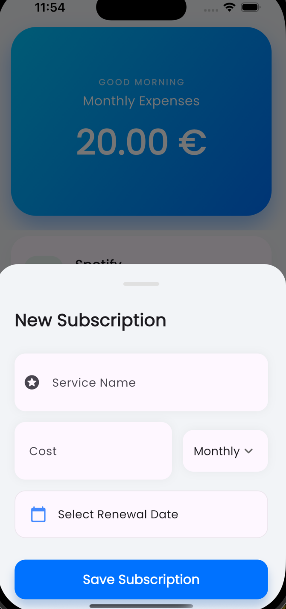
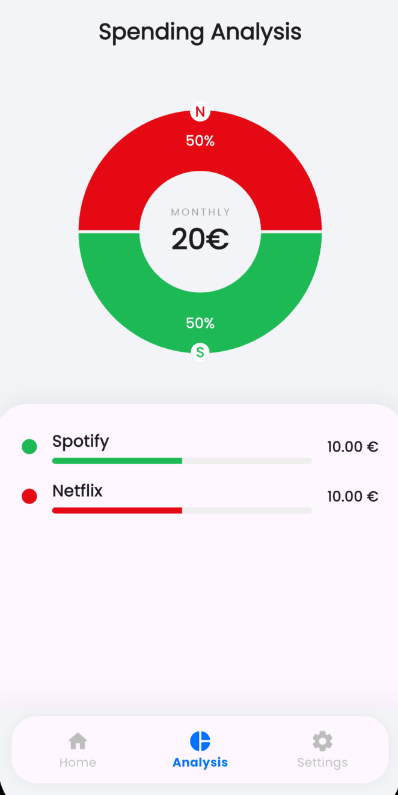

# ❄️ Sub-Zero: Intelligent Subscription Manager

**Sub-Zero** is a modern, minimalist Flutter application designed to track your recurring expenses. It goes beyond simple tracking by analyzing your spending habits to generate a unique "Subscriber Persona" and providing visual insights into your financial digital footprint.

<p align="center">
  
</p>

## Key Features

* **Smart Recognition:** Automatically detects brand colors and icons (Netflix, Spotify, Xbox, etc.) as you type.
* **Persona Engine:** Analyzes your spending data to assign you a character (e.g., *The Binge Watcher*, *The Audiophile*, *The Tycoon*).
* **Visual Analysis:** Beautiful, interactive pie charts and linear indicators powered by `fl_chart`.
* **Flexible Cycles:** Seamlessly handles both Monthly and Yearly billing cycles with accurate monthly cost normalization.
* **Local & Private:** Built with **Hive** (NoSQL database). All data stays on your device. Zero cloud dependency.
* **Cinematic UI:** Smooth fade-in animations, haptic feedback, and a "Rolling Counter" for expenses.
* **Dark Mode:** Fully supported AMOLED-friendly dark theme.

## 🛠️ Tech Stack

* **Framework:** [Flutter](https://flutter.dev/) (Dart)
* **Storage:** [Hive](https://docs.hivedb.dev/)
* **State Management:** `ValueListenableBuilder` (Native & Reactive)
* **Charts:** [fl_chart](https://pub.dev/packages/fl_chart)
* **Typography:** [Google Fonts](https://pub.dev/packages/google_fonts) (Poppins)
* **Notifications:** flutter_local_notifications

##  Screenshots

| Home Screen | Smart Entry | Persona Analysis |
|:---:|:---:|:---:|
|  |  |  |

##  Installation

1.  **Clone the repo:**
    ```bash
    git clone [https://github.com/nasimanwari/sub_zero]
    ```
2.  **Install dependencies:**
    ```bash
    cd sub-zero
    flutter pub get
    ```
3.  **Run the app:**
    ```bash
    flutter run
    ```

##  Contributing

Contributions are welcome! Please feel free to submit a Pull Request.

##  License

This project is licensed under the MIT License - see the [LICENSE](LICENSE) file for details.